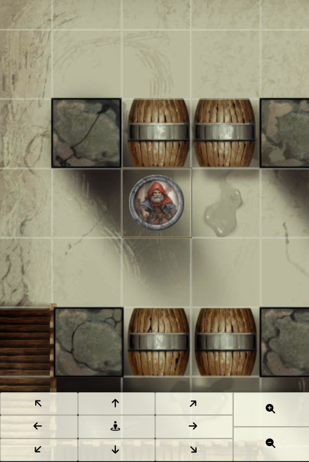
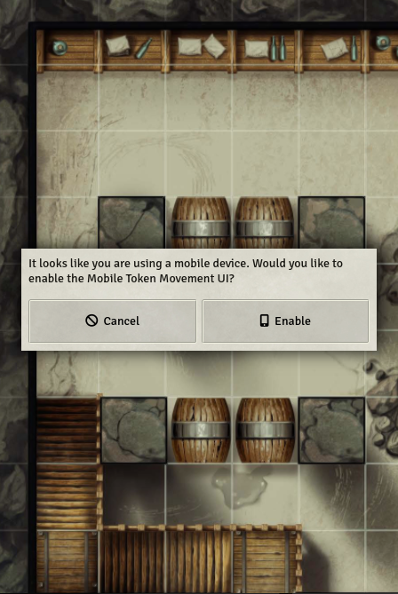

# FoundryVTT In-person Toolbox

A collection of quality-of-life tools I use when DM-ing for in-person groups.

## Features:
- Simplified UI for mobile devices with on-screen token movement controls 
- Configurable auto focus/select active token in combat so players have an easier time keeping track of who is currently taking their turn in battle

## Recommended modules
- [**TouchVTT**](https://foundryvtt.com/packages/touch-vtt) for easier navigation/token selection on mobile
- [**Stream View**] on a TV screen for a centralized map view (players can control their tokens on their mobile devices)
- [**Monk's Common Display**] for more control over the players' view

## Recommended setup
I usually run games from my laptop using the GM view. A separate window is cast to a nearby TV logged in as an "observer" user through Stream view (this user also owns all player tokens, so they have shared vision)

Players log in to Foundry through their mobile devices and move their characters using the movement UI

If players are already using their phones as their character sheets (i.e. DND Beyond or Pathbuilder), 
I set out a tablet on the table, so they don't have to go back and forth between the app and browser.

---

|             Mobile UI              |                         Dialog                         |
|:----------------------------------:|:------------------------------------------------------:|
|  |  |

_Credit for the original mobile UI goes to [Matthijs Kok](https://gitlab.com/MatthijsKok) - [repository](https://gitlab.com/MatthijsKok/mobile-token-movement)_

---

## Troubleshooting

- ### The mobile interface isn't showing up when connecting from a mobile device/device with small screen
  Try checking your settings and adjust the minimum screen dimensions to trigger the interface
  
  I'd also recommend using Chrome for the mobile controls as I found it renders the map faster than Firefox
  
  Also, some versions of Firefox do not call the `ready` hook properly (which prevents the mobile interface being shown)

- ### The map is shown as a black screen when viewing on mobile
  This is a WebGL issue unrelated to this module - each browser has a maximum texture size it is able to render (with mobile devices usually having a lower threshold). 
  Check the `Max 2D Texture Size` attribute [here](https://alteredqualia.com/tmp/webgl-maxparams-test/) and scale your map down accordingly

Notice any bugs? Feel free to open an issue [here](https://github.com/NicolasAssouline/mobile-token-movement/issues/new/choose) 
or [submit your own PR](https://github.com/NicolasAssouline/mobile-token-movement/compare)

