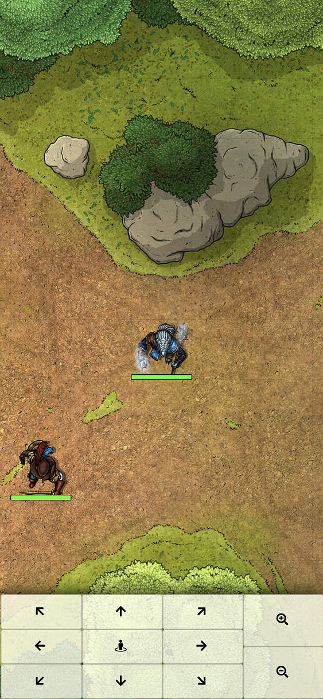

# FoundryVTT Mobile Token Movement (revived)

_Credit for the base version goes to [Matthijs Kok](https://gitlab.com/MatthijsKok)_

The original was outdated and didn't work for the current FoundryVTT version - This module looked perfect for use 
when DM-ing for my in-person group, so I updated it to work with FoundryVTT 11, polished up the code and added a couple new features

This repository is a reupload due to [the original](https://gitlab.com/MatthijsKok/mobile-token-movement) being on Gitlab

## New features/fixes:
- The minimum width to trigger the mobile layout is now configurable through the settings menu
- Added a user-configurable minimum height requirement (both requirements can be toggled on/off)
- Tapping the select button now first centers the view on your currently selected token and 
  then cycles through selected tokens, so it's easier to move larger groups around
- Fixed movement for small and tiny token sizes
- More stringent permission checks to prevent player-facing error popups when trying to move un-owned characters

## Recommended modules
- **TouchVTT** for easier navigation/token selection on mobile
- **Monk's Common Display** for more control over the players' view

## Troubleshooting

- ### The mobile interface isn't showing up when connecting from a mobile device/device with small screen
  Try checking your settings and adjust the minimum screen dimensions to trigger the interface
  
  I'd also recommend using Chrome for the mobile controls because I found it renders the map faster than Firefox
  
  Also, some versions of Firefox do not call the ready hook properly (which prevents the mobile interface being shown)
- ### The map is shown as a black screen when viewing on mobile
  This is a WebGL issue unrelated to this module - each device has a maximum texture size it is able to render (with mobile devices usually having a lower threshold). 
  Check the `Max 2D Texture Size` attribute [here](https://alteredqualia.com/tmp/webgl-maxparams-test/) and scale your map down accordingly

Notice any bugs? Feel free to open an issue [here](https://github.com/NicolasAssouline/mobile-token-movement/issues/new/choose) 
or [submit your own PR](https://github.com/NicolasAssouline/mobile-token-movement/compare)

---

Use your mobile device to control your token with a minimal interface.  
Useful for in-person games with a player-facing monitor using the module Monk's Common Display.  

## How To Use
To enable the mobile interface, accept the popup dialog with your mobile device.  
Any device ~~with a width smaller than 600px~~ _matching the minimum width or height requirements_ will get this popup dialog when connecting.

Make sure you have a character assigned to the users that will be on a mobile device.

## Compatibility
Tested with these modules:
- Monk's Common Display
- Auto-rotate

## Screenshots
#### The mobile interface

